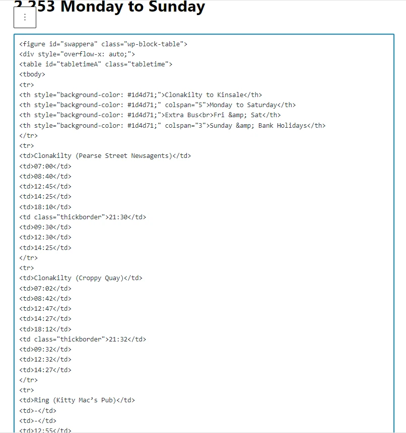

# HTML Table Builder 

LLC denotes Local Link Cork
-
---------------------------

## Site Goals

HTML Table Builder is an application developed in Python for LLC Timetable Management staff.

These staff members typically have no coding abilities whatsoever.

This application is designed to auto generate html table code for [Timetables](https://docs.google.com/spreadsheets/d/1jYRHNID-pMeB-0QicIMgrDnd4QONLxxHhUE7Rz6iz2s/edit?usp=sharing) stored on Google Sheets.

<mark>Note: See GDPR and Privacy Section</mark>

This application is an assist for LLC staff engaged in Timetable Management to easily publish timetable revisions to the LLC website.   

HTML Table Builder is useful by allowing LLC staff to manipulate and design timetables to best display the data to the public.

Within some pre-defined parameters, they can design the timetable layout to accommodate peculiarities on some routes.

Excel is a familiar environment for LLC staff to work with and a lot of the timetable data is held in excel sheets. 

Google Sheets has a lot of similarities and of course LLC staff can copy and paste their Excel creations to Google Sheets.

<mark>Important Note: All references to Local Link are for Local Link Cork only.</mark>

Google Sheets              |  Python Utility
:-----------------:|:-----------------:
  |  

# UX/UI & Features

## Design Choices

---------------------------

This is a non GUI application.

The only interaction with the user is a simple yes/no input like this:

'Do you wish to proceed (yes/no):

This gets verification from the user whether to proceed or not in running the application.

---------------------------

The user is advised of the consequences of running the application like this:

'Running this Automation Program will overwrite, your previous results'

'But be assured your Timetable Sheets will remain untouched.'

---------------------------

While the application is running the user is kept informed of progress with messages like this:

'Preparing data from worksheets...' and 'Data ready to start creating HTML Table code!'

----------------------------

When the application has finished running the user is advised with messages like this:

'The program is finished executing!'

The user is also advised to look at the completed work on Google Sheets:

'Take a look at Google Sheets to view your HTML Table code.'

----------------------------

The user is instructed on how to proceed with Google sheets and Wordpress:

'Just copy the contents of Cell A1 in the HTML worksheet'

'Then Paste into matching Wordpress Schedule Post'

'Always Check the Wordpress Post Result in the Browser'

----------------------------

## User Stories

- Users who have no programming skills need to be able to publish LLC timtables to the website.
    - This application allows the user to do exactly that.
- Users prefer to work in a familiar environment when manipulating timetables.
    - By using Excel and or Google Sheets the user can work with familiar interfaces.
- Users need to be able to change Timetable data on a regular basis and get the results published without delay.
    - The level of automation here minimises the time delay.
- Users need to be able to redesign timetables like adding an extra column, or putting header text into 2 lines.
    - This application can cater for that.
- Users need to be able to highlight certain columns to draw attention to detail.
    - This application allows for that.
- Users wish to avoid steep learning curves by being introduced to new systems.
    - The Copy and Paste method to publish to the web is a concept they are already familiar with.

--------------------------------

## Site Navigation
 
As there is only one option no navigation is required.

## Responsive
 
This non gui application is responsive and looks good on different device screen sizes.

===============================================================

### How it works

===============================================================

### Google Sheets data and GDPR

- Thanks to Steve Ellis Operations Co-Ordinator of Local Link Cork for permission to use timetable data.

You can view the Sheet here at this link:

https://docs.google.com/spreadsheets/d/1BBsQqCY6lh6nIc1l2HFDc7YwyWFzkEoGZ5WqTOfcxNc/edit?usp=sharing

This Sheet is Shared and visible to anyone with a link.

This Sheet is on my personal Google account and the data is not sensitive.

The Timetable data is already in the public domain.

------------------------------------

### Google Sheets Usage

Base Data to copy and paste from for testing

https://docs.google.com/spreadsheets/d/1jYRHNID-pMeB-0QicIMgrDnd4QONLxxHhUE7Rz6iz2s/edit?usp=sharing

The user sets up Google Sheets prior to running the application

The user can setup as many worksheets as they wish. But typically there would be only a few timetables requiring update at any given time.

The user renames the worksheets to match the Route Number.

Where the timetable is an amalgamation of several routes then the user titles the worksheet with all of the route numbers seperated by a hyphen.

The Basic Rules for Excel Template are provided in the Rules tab in the users Excel file.

These rules do not always impact on the application.

Some of these rules are for visual purposes so the the user can see what the Excel Timetable will look like when it is published in Wordpress.

The rules that impact the Application are in the last column first row.

When the user is happy that the necessary Google Sheets are in place then they can run the HTML Table Builder Application.

Example 253

Google Sheets                     |  Returned HTML                   |  Live on Browser
:--------------------------------:|:--------------------------------:|:-----------------------------------:
  |   | 

---------------------------------

## Application

----------------------------------

The default username is: admin
The default password is: sesame

### Overview

HTML Table Builder Application runs through all the worksheets in Google sheets other than HTML prefixed sheets.

Looping through each sheet the table html code is created and written to a local txt file.

The table elements are gathered in 4 distinct groupings:

1. Table definition html code
2. Table header html code
3. Table Rows html code
4. Table footer html code

When all elements of the table html code have been compiled the txt file is then read.

The files contents are written back to a newly created worksheet with a HTML prefix and the Route number.

Saving the html in a txt file as well as writing it back to the worksheet expands future distribution possibilities for the created html code.

----------------------------------

# Testing

## Tests carried out by me.

- HTML Prefix title on worksheets are ignored.
- Worksheet is not a blank new worksheet (Title:Sheet 1)
- Worksheet title begins with 3 numeric digits.
- Worksheet has no header row.
- Header Row
    - Test with only 1 column
    - Test with Last column not having HEADEND aas text value
    - Rules in Last Colum
        - : rule marker but invalid rules
        - : rule marker but no rules
        - : rule marker with column counter descending
- Only a Header Row, No other rows.

---------------------------------

## Validator Testing

As the PEP8 validator website pep8online.com site is down, I used pycodestyle instead.

run.py is clear of anything underlined in red.

The 3 problems that are listed are apparaently in relation to the docker file and have nothing to do with the code in run.py.

---------------------------------

## User Testing

When the html code is pasted into the wordpress post.

The user can a make a visual comparison in the browser to ensure the results are as expected.

The user is the designer of the timetable (within given parameters of course).

Because the outcome in wordpress reflects the users Excel sheet design, it is up to the user to decide if the outcome is what they planned.

If not, they can amend the Excel file or Google Sheet and run the application again.

---------------------------------

## Development Transition

### Initial Workflow Concept

-----------------------------------

### Table Design in Wordpress Post

Example 253

HTML Design                         |  Wordpress Blocks Basic             
:----------------------------------:|:-----------------------------------:
  |  
---------------------------------
 
## Bug Fixes
 
### Solved Bugs

- October 12th 2022 Closing row <\tr> missing on th heading
    - Fix fa901e13615e548db4457b6e1cfcaa628981f863 tagi s now in place.

### Unfixed Bugs

- No known unfixed bugs

----

## Deployment

### Deployment to Heroku

The site is deployed to Heroku. 

- Ensure pprint is not in place 
- Amend Input to include a new line \n
- Populate Requirements with pip3 freeze > requirements.txt
- Sign up for Heroku Account
- Set role as student
- Create new app in heroku
- Create a config var in settings with a Key of CREDS and with creds.json file content as the Value
- Add Buildpack of Python
- Add Buildpack of Node.js
- In Deploy section and select Github
- Select Repository and Link to heroku app
- Manual Deploy
- Run App
- Test for errors

Please click this link to see it in Heroku

https://html-table-builder.herokuapp.com/

---------------------------------

## Future Features

- To build a pdf version of the timetable.
- To use Zapier Automation to update Wordpress post with table.

----

## Performance Improvements

- Increased Automation

----
 
## Credits

### Inspiration

- Working part time with Local Link Cork and in association with Steve Ellis we identified that staff needed to work on Timetables in Excel.
- Also that these excel timetables needed to to be published to Wordpress.

The challenge is to take data stored in Excel files and bring them to the public.

### Content

- Credit to thispointer for a handy fumction to write multiple lines to a text file

https://thispointer.com/how-to-append-text-or-lines-to-a-file-in-python/

Credit to pynative for code ieas on deleting all the files in a directory

https://pynative.com/python-delete-files-and-directories/#h-example-remove-file-in-python

Credit to pythonpool for code ideas on looping through files in a directory.

https://www.pythonpool.com/python-loop-through-files-in-directory/

Credit to Anna Greaves and Love Sandwiches for Connecting to Google Sheets idea and execution.

----

