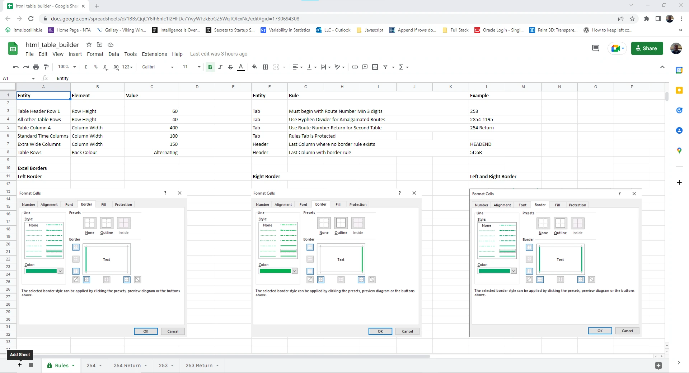
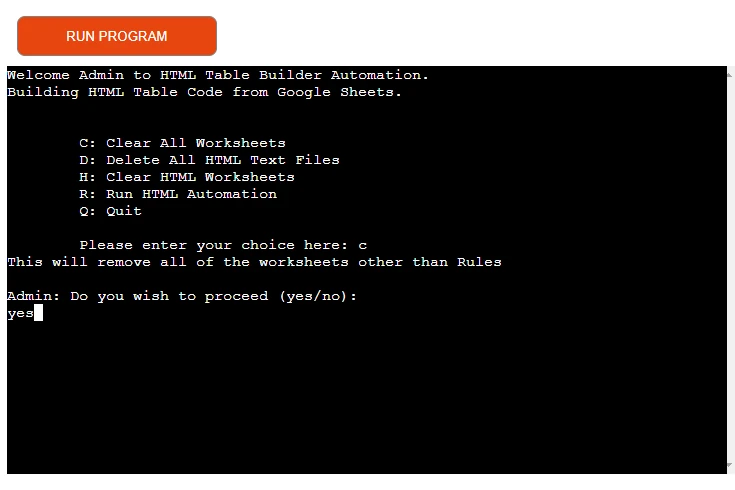
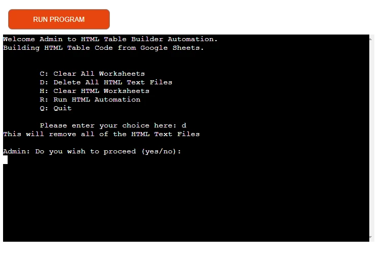
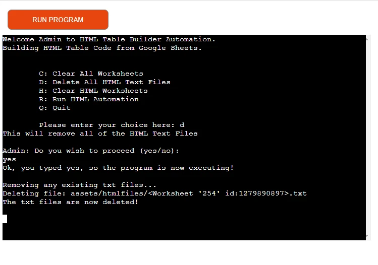
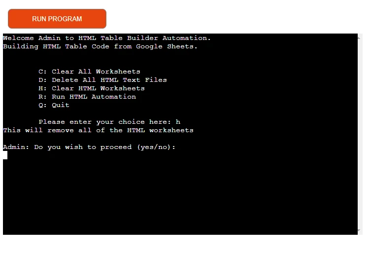
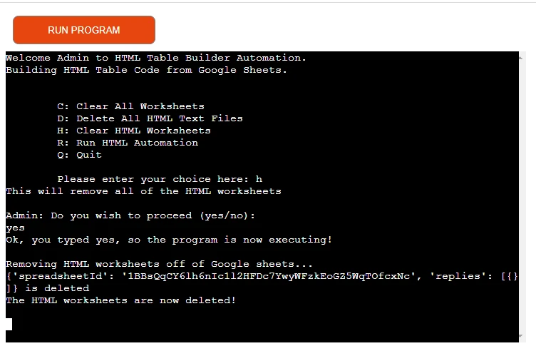
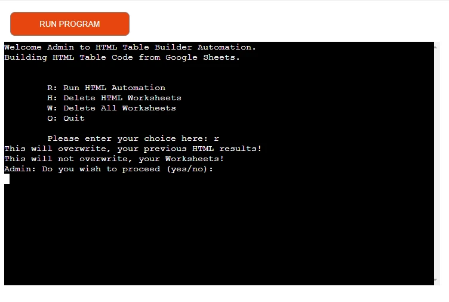
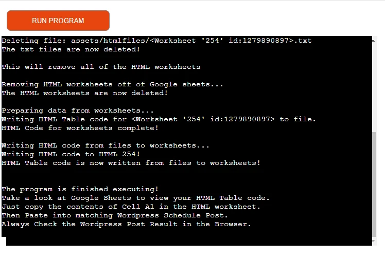
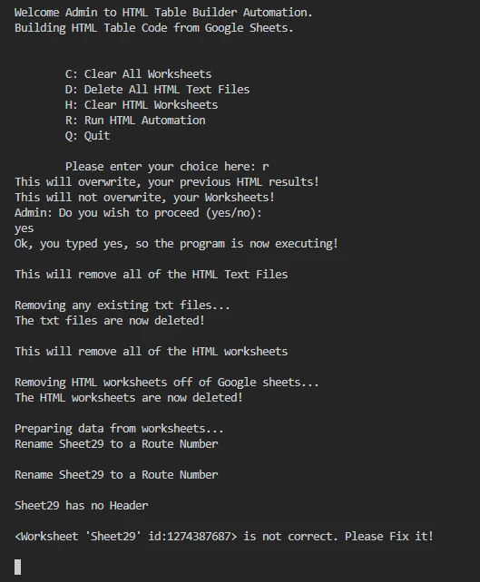

# HTML Table Builder 

LLC denotes Local Link Cork
-
---------------------------

## Site Goals

HTML Table Builder is an application developed in Python for LLC Timetable Management staff.

These staff members typically have no coding abilities whatsoever.

This application is designed to auto generate html table code for [Timetables](https://docs.google.com/spreadsheets/d/1jYRHNID-pMeB-0QicIMgrDnd4QONLxxHhUE7Rz6iz2s/edit?usp=sharing) stored on Google Sheets.

<mark>Note: See GDPR and Google Sheets Data</mark>

This application is an assist for LLC staff engaged in Timetable Management to easily publish timetable revisions to the LLC website.   

HTML Table Builder is useful by allowing LLC staff to manipulate and design timetables to best display the data to the public.

Within some pre-defined parameters, they can design the timetable layout to accommodate peculiarities on some routes.

Excel is a familiar environment for LLC staff to work with and a lot of the timetable data is currently held in excel sheets. 

Google Sheets has a lot of similarities and of course LLC staff can copy and paste their Excel creations to Google Sheets.

<mark>Important Note: All references to Local Link are for Local Link Cork only.</mark>

Google Sheets              |  Python Utility
:-----------------:|:-----------------:
  |  

# UX/UI & Features

## Design Choices

---------------------------

This is a non GUI application.

The initial interaction with the user is a simple login like this:

Please enter your username:

Please enter your password:

---------------------------

Once logged in the user is presented with a Main Menu:

---------------------------

The user also has access to two Google Sheets:

1. html_table_builder

<mark>This is the Sheet that the Application interacts with</mark>

2. Timetables

<mark>This is the Sheet that Contains all the Timetable worksheets</mark>

<mark>Note: Both Sheets have a Rules Tab which is for reference only</mark>

---------------------------

## User Stories
---

- Users who have no programming skills need to be able to publish LLC timetables to the website.
    - This application allows them to work without HTML or CSS skills, as the application makes the html for them, then using copy and paste skills they can publish to wordpress. The styling of the timetable is managed within the wordpress template design. 
- Users prefer to work in a familiar environment when manipulating timetables.
    - By using Excel and or Google Sheets the user can work with familiar interfaces.
- Users need to be able to change Timetable data on a regular basis and get the results published without delay.
    - The level of automation here minimises the time delay and allow the user to quickly publish to wordpress.
- Users need to be able to redesign timetables like adding an extra column, or putting header text into 2 lines.
    - Working with Google sheets and/or Excel allows the user to design or manipulate timetables to suit their needs.
- Users need to be able to highlight certain columns to draw attention to detail.
    - Users can highlight cells by using heavy green borders. These borders are picked up by the application by reading specified rules within designated cells. 
- Users wish to avoid steep learning curves by being introduced to new systems.
    - The Copy and Paste method to publish to the web is a concept they are already familiar with and the Excel and Google Sheets interaction is familiar to them .

--------------------------------

## Site Navigation
 
Site navigation is by way of a Main Menu which is presented after User login.

## Responsive
 
This non gui application is responsive and looks good on different device screen sizes.

--------------------------------

# GDPR and Google Sheets Data

- Thanks to Steve Ellis Operations Co-Ordinator of Local Link Cork for permission to use timetable data.

- The Sheets are Shared and visible to anyone with a link.

- The Sheets are on my personal Google account and the data is not sensitive.

- The Timetable data is already in the public domain.

------------------------------------

# Google Sheets

## 1. Timetables Sheet

The Timetables sheet contains the timetable information for all routes.

<mark>For the purposes of demo this shared sheet contains worksheets(tabs) that show a cross section of timetable variations and types</mark>

https://docs.google.com/spreadsheets/d/1jYRHNID-pMeB-0QicIMgrDnd4QONLxxHhUE7Rz6iz2s/edit?usp=sharing

## 2. html_table_builder sheet

The html_table_builder sheet is the sheet that the application interacts with.

<mark>Typically the initial status of this sheet is to only contain 1 worksheet(tab) called Rules</mark>

https://docs.google.com/spreadsheets/d/1BBsQqCY6lh6nIc1l2HFDc7YwyWFzkEoGZ5WqTOfcxNc/edit?usp=sharing

------------------------------------

# How it works

## Google Sheets

We will use the route 254 as an example.

The steps are as follows:

First the user interacts with the Timetables Sheet

- 1. The user selects the worksheet(tab) that they need html code for.
- 2. The users selects the range of active cells in the worksheet.
- 3. The user then types Ctrl + C to copy the selected range of cells.
- 4. The user notes the route number which is the title of the tab.

Now the user interacts with the html_table_builder Sheet

- 1. The user by clicking the + sign can create a new worksheet(tab) 
- 2. The user renames the worksheet(tab) to the appropriate Route number.
- 3. The user selects cell A1 and then types Ctrl + V to paste.

Rename             |  Paste
:-----------------:|:-----------------:
  |  

<mark>The user can setup as many worksheets as they wish by repeating this process, but typically there would be only a few timetables requiring publishing at any given time</mark>

When the user is happy that the necessary Google Sheets are in place then they can run the HTML Table Builder Application.

<mark>Important Note: For testing purposes the html_table_builder has already been populated with some sheets from Timetables</mark>

## Rules

The Basic Rules for the Sheets are provided in the Rules worksheet(tab).

These rules do not always impact on the application or have a HTML consequence.

Some of these rules are for visual purposes so the the user can see what the Timetable will look like when it is published in Wordpress.

### Application Specific Rules

The rules that impact the Application are in the last column first row.

This cell will contain either of the following:

- 1. HEADEND <mark>This is the end of Header marker for the application where there are no border instructions</mark>

- 2. Border Instructions <mark>These instructions are read by the application and also serve as an end of Header marker</mark>

Left and Right Border             |  Left Border or Right Border
:-----------------:|:-----------------:
  |  

### Borders Explained

- A cell(column) can have a border on the left and the right. This is designated with a B.
- A cell(column) can have a border on the Left only. This is designated with an L.
- A cell(column) can have a border on the Right only. This is designated with an R.

The user indicates where the borders are to be placed. The application picks up on this instruction.

For example: 

- 7B means a border left and right on column 7
- 7L:8R means a left border on column 7 and a right border on column 8

<mark>':' is the symbol used to indicate a rule break point</mark>

------------------------------------

# Application

This is a non GUI application.

## Login

The initial interaction with the user is a simple login like this:

Please enter your username:

Please enter your password:

The default username is: admin
The default password is: sesame

## Main Menu

Once logged in the user is presented with a Main Menu:

### C. Clear All Worksheets

<mark>Important Note: When testing you should test this option last as it removes all sheets and then you have to copy and paste to populate html_table_builder for other testing</mark>

This deletes all of the worksheets in html_table_builder with the exception of Rules.

This allows the user to go to a reset situation.

The User is advised that 'This will remove all of the worksheets other than Rules'

The user is challenged to input yes if they wish to proceed.

Select C to Clear Sheets             |  Type yes to proceed
:-----------------:|:-----------------:
  |  

The user is advised that the worksheets are now deleted!

Then the application clears the console and returns to the main menu after 1 second.

### D. Delete All HTML Text Files   

This deletes all of the HTML Text Files that are stored for now in assets/htmlfiles

These are created when a user runs R. Run HTML Automation.

This is a feature added to allow a clear out of HTML txt files.

The R. Run HTML Automation routine will automatically remove any existing HTML txt files that correspond to any route worksheets(tabs) in html_table_builder sheet. This ensures that the html code is freshly built each time the routine is run.

The User is advised that 'This will remove all of the HTML Text Files'

The user is challenged to input yes if they wish to proceed.

Select D to Delete All HTML Text Files            |  Type yes to proceed
:-----------------:|:-----------------:
  |  

The user is advised that the txt files are now deleted!

Then the application clears the console and returns to the main menu after 1 second.

### H. Clear HTML Worksheets 

This deletes all of the worksheets(tabs) that have a HTML Prefix in the title.

These are created when a user runs R. Run HTML Automation.

This is a feature added to allow a clear out of worksheets(tabs) with HTML Prefix.

Select H to Clear HTML Worksheets            |  Type yes to proceed
:-----------------:|:-----------------:
  |  

The user is advised that the HTML worksheets are now deleted!

Then the application clears the console and returns to the main menu after 1 second.

### R. Run HTML Automation

HTML Table Builder Application runs through all the worksheets in Google sheets other than HTML prefixed sheets.

Looping through each sheet the table html code is created and written to a local txt file.

The table elements are gathered in 4 distinct groupings:

1. Table definition html code
2. Table header html code
3. Table Rows html code
4. Table footer html code

When all elements of the table html code have been compiled the txt file is then read.

The files contents are written back to a newly created worksheet with a HTML prefix and the Route number.

<mark>Saving the html in a txt file as well as writing it back to the worksheet expands future distribution possibilities for the created html code</mark>

Select R to Run HTML Automation           |  Type yes to proceed
:-----------------:|:-----------------:
  |  

While the application is running the user is kept informed of progress with messages like this:

'Preparing data from worksheets...' and 'Data ready to start creating HTML Table code!'

When the application has finished running the user is advised with messages like this:

'The program is finished executing!'

The user is also advised to look at the completed work on Google Sheets:

'Take a look at Google Sheets to view your HTML Table code.'

The user is instructed on how to proceed with Google sheets and Wordpress:

'Just copy the contents of Cell A1 in the HTML worksheet'

'Then Paste into matching Wordpress Schedule Post'

'Always Check the Wordpress Post Result in the Browser'

Example 253
  
Google Sheets                     |  Returned HTML                   |  Live on Browser
:--------------------------------:|:--------------------------------:|:-----------------------------------:
  |   | 

Then the application clears the console and returns to the main menu after 10 seconds.
This delay gives the user time to read the instructions.

### Q. Quit

This quits form the application and clears the console.

Then the application clears the console and returns to the main menu after 1 seconds.

----------------------------------

# Testing

## Tests carried out by me.

### Google Sheets

- Remove all worksheets(tabs) from html_table_builder
    - Google Sheets will not let me
- Rename Rules
    - This is a protected sheet so Google sheets will not let me
- Delete or edit data in Rules
    - This is a protected sheet so Google sheets will not let me

<mark>These tests are important as the application expects to find at least 1 worksheet(tab) called Rules</mark>

### Application

- C. Clear All Worksheets when there are no worksheets in html_table_builder
    - Code runs fine and returns to Main Menu (Rules is always present)
- C. Clear All Worksheets when there are worksheets in html_table_builder
    - All worksheets are cleared and returns to Main Menu (Rules is always present)
- D. Delete All HTML Text Files when there are no txt files in assets/htmlfiles
    - Code runs fine and returns to Main Menu
- D. Delete All HTML Text Files when there are txt files in assets/htmlfiles
    - All text files are deleted and and returns to Main Menu
- H. Clear HTML Worksheets when there are no HTML Prefix worksheets in html_table_builder
- H. Clear HTML Worksheets when there are HTML Prefix worksheets in html_table_builder
    - HTML Prefix worksheets are removed and returns to Main Menu
- R. Run HTML Automation when there are no worksheets other than Rules in html_table_builder
    - Code runs fine and returns to Main Menu
- R. Run HTML Automation when there is only one worksheet with no populated cells in html_table_builder
    - Code runs picks up there is no Header alerts the user and returns to Main Menu
- R. Run HTML Automation when there is only a worksheet with a title containing the word sheet in html_table_builder
    - Code runs picks up the bad title (all titles should begin a minimum of a 3 digit route number) alerts the user and returns to Main Menu

The Run HTML automation checks for sheet validity by checking:

- HTML Prefix title on worksheets are ignored.
- Worksheet is not a blank worksheet
- Worksheet title begins with 3 numeric digits.
- Worksheet has a header row.

The Header row is tested for:

- Test with only 1 column
- Test with Last column not having HEADEND as text value
- Test with Last column not having Border Rules as text value

The Last Column of Header Row is checked for:
- Rules in Last Column
        - : rule marker but invalid rules
        - : rule marker but no rules
        - : rule marker with column counter descending

The worksheet is checked for:

- Only a Header Row, No other rows.

- Q. Quit
    - The application clears the consoles and quits as expected

<mark>For all menu options I also tested for when the user did not type yes</mark>

### Worksheets with HTML Prefix

Visual check that the html table structure is in place with closing and opening tags

---------------------------------

## Validator Testing

As the PEP8 validator website pep8online.com site is down, I used pycodestyle instead.

run.py is clear of anything underlined in red.

The 3 problems that are listed are apparaently in relation to the docker file and have nothing to do with the code in run.py.

---------------------------------

## User Testing

When the html code is pasted into the wordpress post, the user can a make a visual comparison in the browser to ensure the results are as expected.

The user is the designer of the timetable (within given parameters of course).

Because the outcome in wordpress reflects the users Google sheet design, it is up to the user to decide if the outcome is what they planned.

If not, they can amend the Google Sheet and run the application again.

---------------------------------

## Development Transition

### Initial Workflow Concept

-----------------------------------

### Table Design in Wordpress Post

Example 253

HTML Design                         |  Wordpress Blocks Basic             
:----------------------------------:|:-----------------------------------:
  |  
---------------------------------
 
## Bug Fixes
 
### Solved Bugs

- October 12th 2022 Looping through header error colspan count wrong
    - Fix d5f826cfade97fa0f427bcf71ad71f15b8e42d36 reverse header data

- October 12th 2022 Closing row <\tr> missing on th heading
    - Fix fa901e13615e548db4457b6e1cfcaa628981f863 tag is now in place.

- October 13th 2022 border rules not working correctly
    - Fix 23167325d5e54eea7128b125e2041a8f5337fa16 improved function to manage rules.

- October 15th 2022 sheet errors problem
    - Fix 62b6fee4d708f5946810424a4479d533b0a040e3 create function to validate sheets.

- October 28th 2022 login error on heroku
    - Fix 37a3cb2f048fbd6cb6159aa83a503e6d317b3311 remove user csv file from gitignore.

### Unfixed Bugs

- If the html_table_builder sheet does not exist or is not found the application will crash with a json response back from Google sheets. There is no error trap in place for this.

- The users.csv contains the login information. For a demo this is fine for it to be exposed. But in a real world situation this data would be called from a secured location like a database.

----

## Deployment

### Deployment to Heroku

The site is deployed to Heroku. 

- Ensure pprint is not in place 
- Amend Input to include a new line \n
- Populate Requirements with pip3 freeze > requirements.txt
- Sign up for Heroku Account
- Set role as student
- Create new app in heroku
- Create a config var in settings with a Key of CREDS and with creds.json file content as the Value
- Add Buildpack of Python
- Add Buildpack of Node.js
- In Deploy section and select Github
- Select Repository and Link to heroku app
- Manual Deploy
- Run App
- Test for errors

Please click this link to see it in Heroku

https://html-table-builder.herokuapp.com/

### Live Deployment for LLC

This project has been copied to https://github.com/TMartin88/SheetTable

<mark>I am further developing the application for LLC as they require this functionality to go live ASAP</mark>

---------------------------------

## Future Features

- To build a pdf version of the timetable.
- To read the google sheet formatting instead od relying on border rules.
- To error trap Google sheet connection failures
- To use Zapier Automation to update Wordpress post with table.

----

## Performance Improvements

- Increased Automation

----
 
## Credits

### Inspiration

- Working part time with Local Link Cork and in association with Steve Ellis we identified that staff needed to work on Timetables in Excel.
- Also that these excel timetables needed to to be published to Wordpress.

The challenge is to take data stored in Excel files and bring them to the public.

### Content

- Credit to thispointer for a handy fumction to write multiple lines to a text file

https://thispointer.com/how-to-append-text-or-lines-to-a-file-in-python/

Credit to pynative for code ieas on deleting all the files in a directory

https://pynative.com/python-delete-files-and-directories/#h-example-remove-file-in-python

Credit to pythonpool for code ideas on looping through files in a directory.

https://www.pythonpool.com/python-loop-through-files-in-directory/

Credit to Anna Greaves and Love Sandwiches for Connecting to Google Sheets idea and execution.

----

